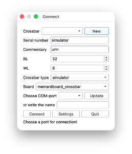
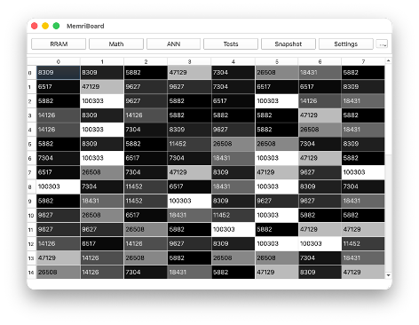
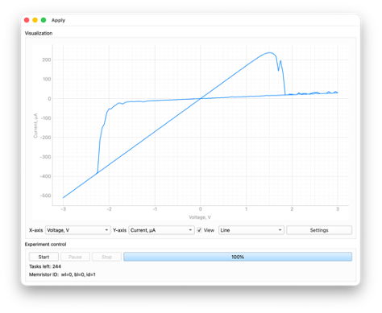
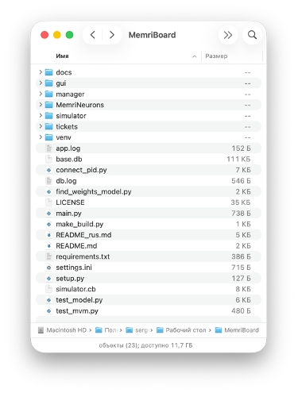

# Setting Up the Working Environment

## Table of Contents

- [1. MemriBoard Setup](#1-memriboard-setup)
  - [Cloning or Extracting the Repository](#cloning-or-extracting-the-repository)
  - [Virtual Environment and Dependencies](#virtual-environment-and-dependencies)
  - [Launching the Program](#launching-the-program)
  - [Creating the Simulator](#creating-the-simulator)
  - [Verification and Success Criteria](#verification-and-success-criteria)
- [2. MemriNeurons Setup](#2-memrineurons-setup)
  - [Accessing the Repository](#accessing-the-repository)
  - [Project Structure](#project-structure)
  - [Running the Validation Script](#running-the-validation-script)

---

## 1. MemriBoard Setup

To set up **MemriBoard**, follow the steps below.

### Cloning or Extracting the Repository

- **If you know how to use git and GitHub**, clone the `dev` branch to your PC:

  ```bash
  git clone git@github.com:neurocomputer/MemriBoard.git -b dev
  ```

- **If you don't know how to use git and GitHub**, extract the `MemriBoard.zip` archive.

### Virtual Environment and Dependencies

Set up a virtual environment and install the required dependencies from `requirements.txt` (relevant for macOS) or manually (`numpy`, `pyqt5`, `pyqtgraph`, `pandas`, `sqlalchemy`, `matplotlib`, `tensorflow`):

```bash
python3 -m venv venv
source venv/bin/activate
python3 -m pip install --upgrade pip
pip install -r requirements.txt
```

### Launching the Program

Launch the main program window:

```bash
python3 main.py
```

### Creating the Simulator

Create a crossbar array simulator of memristors, as shown in the figure below.



Make sure that a file named `simulator.cb` appears in the `MemriBoard` folder.

### Verification and Success Criteria

Next, follow the instructions and check whether the simulator works:  
[https://github.com/neurocomputer/MemriBoard/tree/dev/docs](https://github.com/neurocomputer/MemriBoard/tree/dev/docs)

**Success** can be considered the achievement of obtaining the simulator's resistance map, and the current–voltage (I–V) characteristic of a cell, as shown in the figures below.





---

## 2. MemriNeurons Setup

To set up **MemriNeurons**, follow the steps below.

### Accessing the Repository

The program is available on GitHub, but is currently in a **private repository**. Therefore:

- **If you know how to use git and GitHub**, let me know your github username and I will add you to the repository as a collaborator. Then you will be able to clone the code.

- **If you don't know how to use git and GitHub**, extract the `MemriNeurons.zip` archive into the `MemriBoard` folder.

### Project Structure

After extracting, make sure the project structure looks as shown in the figure below (MemriNeurons inside MemriBoard).



### Running the Validation Script

Copy the `check_memrineurons.py` script into the `MemriBoard` folder and run it.

**Success** means the script executes without errors, and a number close to **0.1** is printed to the terminal.