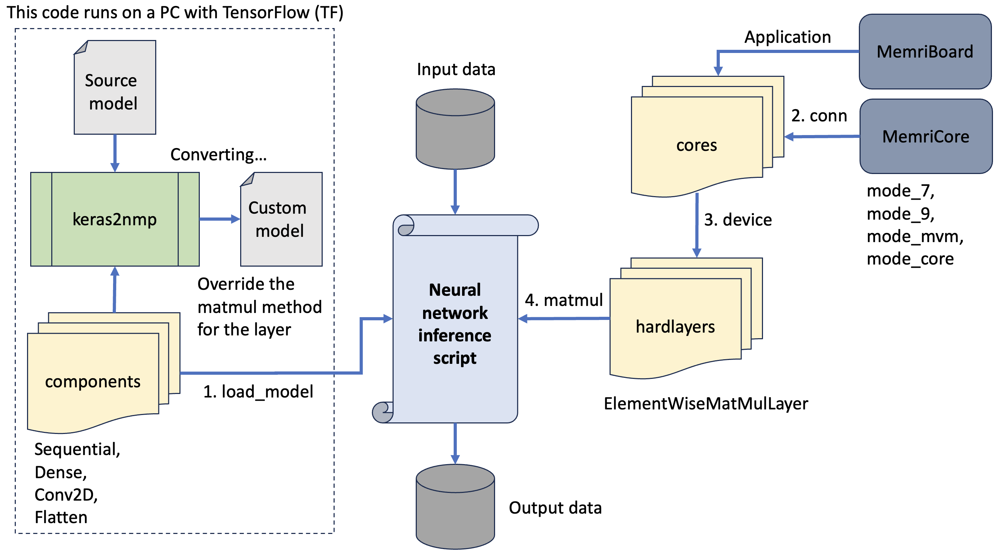

# MemriNeurons Pipeline

---

## Pipeline Stages

### 1. Load and Convert Model (`load_model` and `keras2nmp`)
- Neural network model loaded from TensorFlow/Keras
- Supports: `Sequential`, `Dense`, `Conv2D`, `Flatten`
- Custom conversion from Keras to MemriCore-compatible format

### 2. Device Initialization (`conn`)
- Connection to MemriBoard hardware
- MemriCore executes operations using:
  - `mode_7`
  - `mode_9`
  - `mode_mvm`
  - `mode_core`

### 3. Device Handler (`device`)
  - performs top-level functions for working with the board (reading/writing weights, performing multiplications and scalar products)

### 4. Neural Network Inference (`matmul`)
- Override the standard `matmul` method for hardware acceleration
- Uses custom layer: **ElementWiseMatMulLayer**
- Components: **hardlayers**

### 5. Get Output Data
- Inference results from the neural network running on memristor hardware

---
