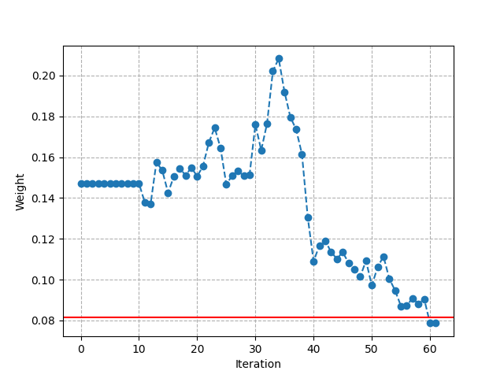
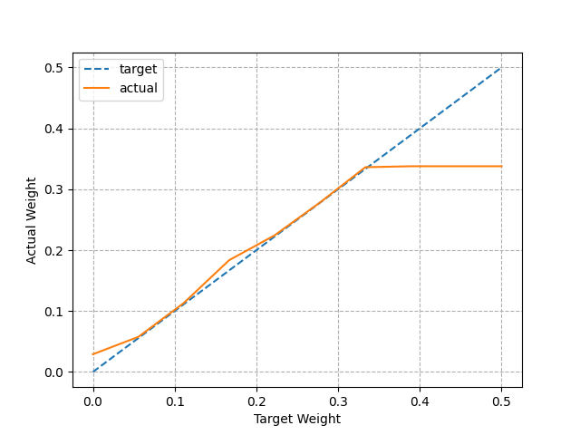
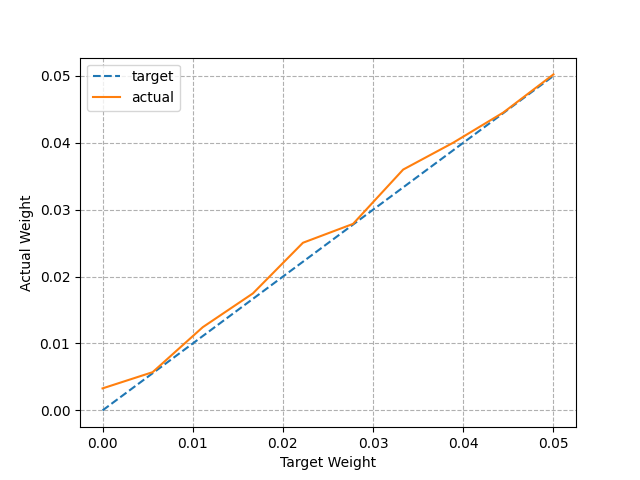

# Neural Network Test on Memristors (XOR Network)

This script demonstrates the complete workflow for running a neural network inference on a memristor-based hardware platform. The example uses a simple **XOR** neural network to validate all core functionalities.

---

## Overview

The script performs a series of tests that validate different aspects of the memristor hardware:

1. **Read/Write operations** – reading and writing individual weights and entire matrices
2. **Arithmetic operations** – multiplication and dot product
3. **Weight characteristics** – dynamic range of weights
4. **Neuron implementation** – custom single neuron
5. **Neural network inference** – manually assembled and automatically converted XOR network

---

## Imports and Dependencies

```python
import os
import numpy as np
import matplotlib.pyplot as plt

from simulator.src import BoardSimulator          # connection to the board
from MemriNeurons.cores import HardCore           # core processing engine
from MemriNeurons.hardlayers import ElementWiseMatMulLayer  # custom hardware layer
from MemriNeurons.components import Activations   # activation functions
from MemriNeurons.keras2nmp import convert_keras_2_nmp  # model converter
from MemriNeurons.components import load_model    # model loader
```

### Component Descriptions

| Module | Description |
|--------|-------------|
| **BoardSimulator** | Simulates the memristor board connection (or connects to real hardware) |
| **HardCore** | Core class that manages all hardware operations (read, write, multiply, etc.) |
| **ElementWiseMatMulLayer** | Custom layer that overrides standard matrix multiplication with hardware-accelerated analog computation |
| **Activations** | Contains activation functions (e.g., sigmoid) for neural network layers |
| **convert_keras_2_nmp** | Converts a standard Keras model to the custom hardware format |
| **load_model** | Loads a model from the custom format |

---

## Configuration

### Display Settings
```python
np.set_printoptions(precision=4, suppress=True, formatter={'all': lambda x: f'{x:0.4f}'})
```
Sets NumPy print options for clean, formatted output with 4 decimal places.

### Test Flags
```python
TEST_READ_WRITE = 1           # weight read/write test
TEST_READ_WRITE_MATRIX = 1    # matrix read/write test
TEST_MULTIPLICATION = 1       # multiplication test
TEST_DOT_PRODUCT = 1          # dot product test
TEST_WEIGHT_RANGE = 1         # weight dynamic range test
TEST_CUSTOM_NEURON = 1        # single neuron creation test
TEST_ANN = 1                  # manually assembled ANN test
TEST_ANN_TF = 1               # ANN test with automatic conversion
```
Each flag toggles a specific test. Set to `1` to run or `0` to skip.

---

## Hardware Initialization

### Step 1: Connect to the Board
```python
CONN = BoardSimulator()
_ = CONN.connect('simulator')
```
- Creates a connection to the board (simulator or real hardware)
- `'simulator'` uses the software simulator; replace with actual device parameters for real hardware

### Step 2: Create the Core Handler
```python
device = HardCore(CONN)
```
- Initializes the `HardCore` instance with the connection object
- This device object will handle all hardware operations

### Step 3: Voltage Settings (⚠️ Caution!)
```python
device.V_RESET = 3
device.V_SET = 3
device.V_STEP = 0.01
device.T_US = 10
```
- **V_RESET** – voltage for reset operation (max 1.5V for real memristors)
- **V_SET** – voltage for set operation (max 1.5V for real memristors)
- **V_STEP** – voltage step size for gradual writes
- **T_US** – pulse duration in microseconds

> ⚠️ **WARNING:** For real memristors, do NOT exceed 1.5V. Higher voltages may permanently damage the hardware. The values above (3V) are safe only for the simulator.

---

## Test Descriptions

### 1. Read/Write Test (`TEST_READ_WRITE`)

**Purpose:** Validate single weight read/write operations.

**Process:**
- Generates a random target weight between 0 and 0.3
- Writes the weight to cell (0, 0) using the write & verify method
- Plots the weight convergence over iterations (iterative write attempts)



**Visualization:**
- Blue line with markers shows weight evolution
- Red horizontal line shows the target weight

**Verification:** Checks if the final weight matches the target value.

---

### 2. Matrix Read/Write Test (`TEST_READ_WRITE_MATRIX`)

**Purpose:** Validate batch writing of an entire weight matrix.

**Process:**
- Reads all current weights (32×8 matrix)
- Generates random weights in the range [0.07, 0.33]
- Writes the entire matrix at once
- Reads back all weights to verify
- Applies a scaling factor (×10) and saves the result to the `xor` folder

**Why scaling factor?** Memristor weights are small values. Scaling makes them more visible and easier to work with in software.

---

### 3. Multiplication Test (`TEST_MULTIPLICATION`)

**Purpose:** Validate analog multiplication via the read/write loop.

**Process:**
- Writes a weight `W = 0.1` to cell (0, 0)
- Applies input voltage `X = 0.3`
- Hardware computes: `Result = X × W`
- Compares with reference: `0.3 × 0.1 = 0.03`

**Mathematical Operation:**
```
M = V_bl × W_mem × K_x × K_w
```
Where:
- `V_bl` – voltage applied to the memristor (`X / scale_x`)
- `W_mem` – memristor conductance (weight)
- `K_x`, `K_w` – scaling factors

---

### 4. Dot Product Test (`TEST_DOT_PRODUCT`)

**Purpose:** Validate analog dot product using matrix-vector multiplication mode.

**Process:**
- Switches to MVM mode (`device.set_mvm()`)
- Writes random weights to column 0
- Applies a random input vector `X` (size 32)
- Hardware computes: `Σ(X_i × W_i)`
- Compares with reference: `weight_vector @ X` (NumPy dot product)

**Safety Features:**
- Input voltage limit: ≤ 300 mV per channel
- Current limit: ≤ 15 mA total on each column

**Note:** The device is switched back to WR mode after the test.

---

### 5. Weight Dynamic Range Test (`TEST_WEIGHT_RANGE`)

**Purpose:** Measure the achievable weight range in both operation modes.

**Two Modes:**

| Mode | Weight Range | Comment |
|------|--------------|---------|
| **Read/Write** | ~0.07 – 0.33 | Larger range, suitable for training |
| **MVM** | ~0.003 – 0.05 | Smaller range, but linear for inference |





**Visualization:**
- Target vs actual weight plots for both modes
- Helps understand the mapping between target and achievable weights

**Why this matters:** Nonlinearity in weight writing requires calibration. These plots show the write fidelity.

---

### 6. Custom Neuron Test (`TEST_CUSTOM_NEURON`)

**Purpose:** Build and test a single artificial neuron using hardware operations.

**Neuron Formula:**
```
Output = f(x₁ × w₁ + x₂ × w₂)
```
Where `f()` is an activation function (here, linear identity).

**Process:**
- Randomly generates weights (w₁, w₂) and inputs (x₁, x₂)
- Writes weights to cells (0,0) and (1,0)
- Performs two multiplications in hardware and sums them
- Compares with software reference

**Output:**
```
Neuron parameters: x1=..., x2=..., w1=..., w2=...
Written values: w1=..., w2=...
Reference result: ...
Memristor result: ...
```

---

### 7. Manually Assembled ANN Test (`TEST_ANN`)

**Purpose:** Build a two-layer neural network manually using hardware layers.

**Network Architecture:**
```
Input (2) → Dense(2) → Sigmoid → Dense(1) → Sigmoid → Output
```

**Pre-trained Weights:**
- Layer 1: `w1` (2×2), `b1` (2)
- Layer 2: `w2` (2×1), `b2` (1)

**Process:**
1. Define weights and biases manually
2. Create hardware layers with `ElementWiseMatMulLayer`
3. Map weights to the memristor array using `find_weights_model()`
4. Compute forward pass:
   - Layer 1: `out1 = sigmoid(x @ w1 + b1)`
   - Layer 2: `out2 = sigmoid(out1 @ w2 + b2)`
5. Compare hardware results with reference

**Test Data:**
```python
x = [[0, 0], [0, 1], [1, 0], [1, 1]]  # All XOR input combinations
```

**Expected Output:** XOR truth table (`[0, 1, 1, 0]`)

---

### 8. Automatic Conversion Test (`TEST_ANN_TF`)

**Purpose:** Load a complete model from a Keras file and run inference on hardware with minimal manual intervention.

**Process:**

1. **Load Source Model:**
   ```python
   SOURCE_MODEL_PATH = os.path.join('MemriNeurons', 'XOR.keras')
   ```

2. **Convert Model:**
   ```python
   new_model = convert_keras_2_nmp(SOURCE_MODEL_PATH, NEW_MODEL_PATH)
   ```
   - Converts Keras model to custom hardware format

3. **Load Converted Model:**
   ```python
   new_model = load_model(NEW_MODEL_PATH)
   ```

4. **Create Hardware Layers:**
   ```python
   hardlayer1 = ElementWiseMatMulLayer(device, 'Dense_1', save_folder='xor')
   hardlayer1.find_weights_model(new_model.layers[0].get_weights(), 0.33)
   ```

5. **Override Matrix Multiplication:**
   ```python
   new_model.layers[0].matmul = hardlayer1.matmul
   ```
   - Replaces standard software multiplication with hardware-accelerated analog multiplication

6. **Run Inference:**
   ```python
   output = new_model.predict(x)
   ```
   - Forward pass using hardware for matrix multiplications

7. **Compare Results:**
   - Hardware output vs software reference

---

## Folder Structure

```
xor/
├── all_mem_weights.pkl    # Saved weights after mapping
└── (other saved files)
```

The `xor` folder is created to store:
- Mapped weights
- Calibration data
- Readback results

---

## Summary of Hardware Operations

| Operation | Method | Mode Required |
|-----------|--------|---------------|
| Read single weight | `read_one_weight()` | WR / MVM |
| Write single weight | `write_weight()` | WR |
| Read all weights | `read_raw_weights()` | WR / MVM |
| Write matrix | `write_matrix()` | WR |
| Multiplication | `multiplication()` | WR |
| Dot product | `dot_product()` | MVM |
| Load mapped weights | `find_weights_model()` | WR |
| Override matmul | `matmul` replacement | MVM |

---

## Key Safety Features

1. **Voltage Limit:** 300 mV maximum during inference
2. **Current Limit:** 15 mA maximum per column
3. **Write & Verify:** Iterative writing ensures target weight is achieved
4. **Scaling:** Inputs and weights can be scaled to stay within safe ranges

---

## Troubleshooting

| Issue | Possible Cause | Solution |
|-------|----------------|----------|
| "ATTENTION! You tried to apply greater 0.3 V" | Input voltage exceeds limit | Scale down `X` or increase `scale_x` |
| "ATTENTION! ... dot product will be greater than 15mA" | Too much current | Reduce input values or weights |
| Weight write fails to converge | Improper voltage settings | Adjust `V_RESET`, `V_SET`, `V_STEP` |
| Model conversion error | Incompatible Keras version | Use supported Keras/TF version |

---

## Conclusion

This script demonstrates the complete pipeline for running neural networks on memristor hardware:

1. **Connect** to the hardware/simulator
2. **Initialize** the core processor
3. **Map** weights to memristor array
4. **Override** software operations with hardware acceleration
5. **Run inference** with built-in safety protections
6. **Validate** results against software reference

The system successfully emulates a neural network inference engine using analog computing, leveraging Ohm's law for multiplication and Kirchhoff's current law for summation — enabling energy-efficient and fast neural network inference.
